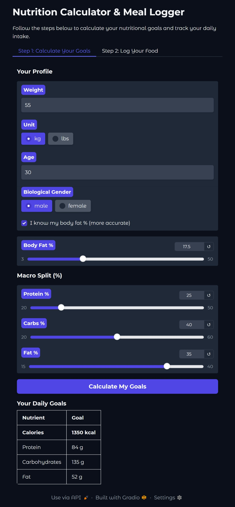
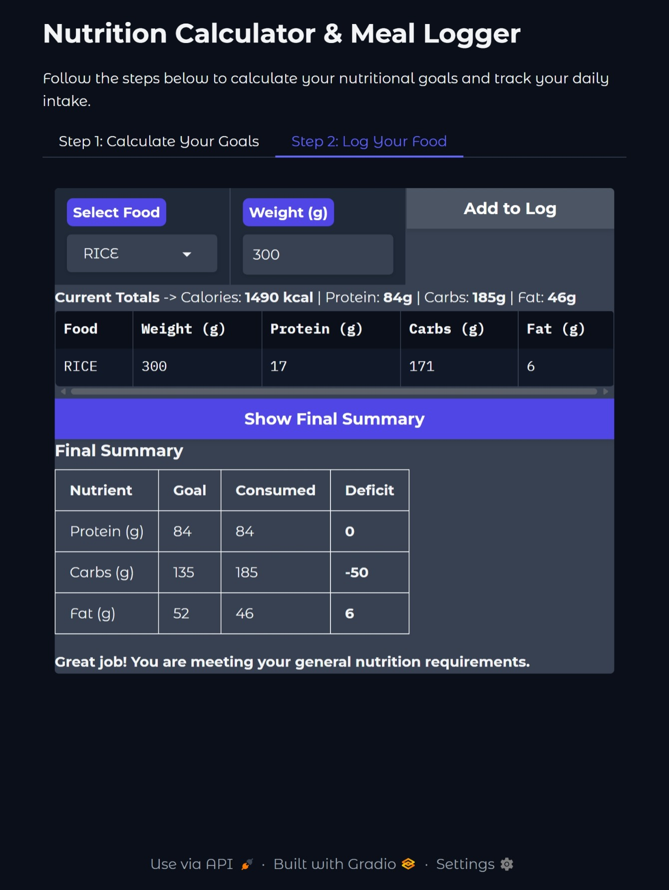
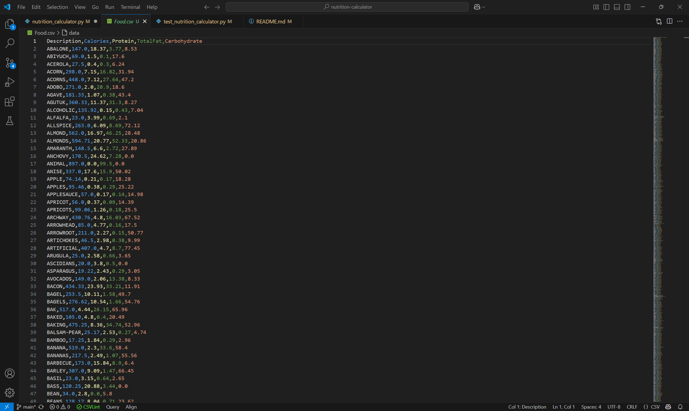
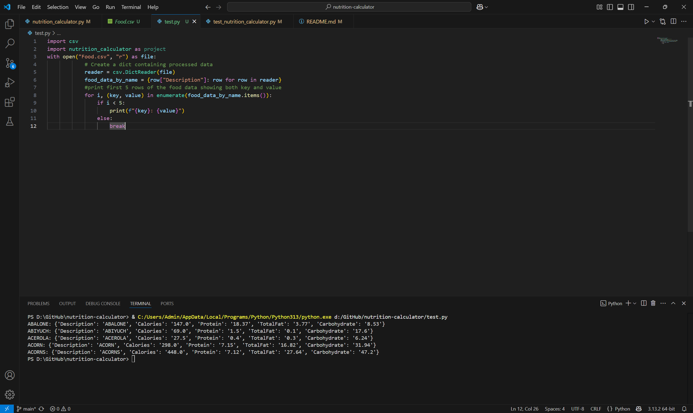

# Nutrition Calculator
## Video Demo:  <https://youtu.be/wrcSv2t546A>
## Data Source: [USDA Food Composition Databases on Kaggle]
(https://www.kaggle.com/datasets/econdata/usda-food-composition-databases)
## Description:
```
I find it useful in todays developed and developing societies, where Food Supply is no longer a problem but Obesity instead, to monitor how you eat and how it may affect your health. Utilizing a dataset from USDA, downloaded from Kaggle, comprising of various foods and their nutritional content with the aid of pandas for pre processing, I created a small terminal based program to calculate Energy Expenditure and the Nutritional Values of Foods.
```

Utilizing a comprehensive dataset from the USDA, this tool provides a user-friendly web interface to:
1.  **Calculate your personalized daily energy expenditure** and macronutrient goals.
2.  **Log the foods you eat** throughout the day.
3.  **Receive an instant summary** of your intake versus your goals, complete with helpful recommendations.

The original terminal-based program has been rebuilt with a Gradio interface, making it more intuitive and accessible for everyone.

## How to Run Locally
1.  **Clone the repository:**
    ```bash
    git clone <your-repo-url>
    cd <your-repo-folder>
    ```
2.  **Install dependencies:** Make sure you have Python installed, then run:
    ```bash
    pip install gradio pandas
    ```
3.  **Download the data:** Place the `USDA.csv` file from the Kaggle link above into the same directory as `app.py`.
4.  **Run the application:**
    ```bash
    python app.py
    ```
5.  **Open the link:** Open the local URL provided in your terminal (usually `http://127.0.0.1:7860`) in your web browser.

## Application Walkthrough

The application is organized into two simple, sequential tabs.

### Step 1: Calculate Your Goals
On the first tab, you enter your personal details to establish your baseline nutritional needs.

-   **Your Profile:** Input your weight, age, gender, and height.
-   **Calculation Method:** For a more accurate estimate, you can check the box and provide your body fat percentage, which uses the Katch-McArdle formula. Otherwise, the app uses the standard Mifflin-St Jeor equation.
-   **Macro Split:** Use the sliders to customize the percentage of your calories that should come from Protein, Carbs, and Fat. The default is a balanced 25/40/35 split.

Once you click **"Calculate My Goals"**, the app will display your target daily calories and grams for each macronutrient.



### Step 2: Log Your Food & See Results
After calculating your goals, the second tab becomes available for you to log your meals.

-   **Add Food:** Use the searchable dropdown to find a food item. The list is generated by grouping common foods from the USDA database (e.g., "BEEF, ground, 85% lean" becomes "BEEF"). Enter the weight in grams and click **"Add to Log"**.
-   **Live Totals:** As you add items, the "Current Totals" and the log table update instantly.
-   **Final Summary:** When you're done logging, click **"Show Final Summary"**. The app presents a clear table comparing your total consumption against your goals, highlighting any deficits. If a deficit is significant, the app provides health warnings and practical food suggestions to help you balance your diet.



---

## Behind the Scenes: The Core Logic
The interactive UI is powered by a set of robust functions in `nutrition_calculator.py`.

### `process_food_data(input_file)`
This function replaces the old `Data_handling`. It now processes the raw `USDA.csv` entirely in memory at startup. It groups foods by their first word (e.g., "BEEF, ground, raw" and "Beef, steak" are both grouped under the "BEEF" category) and calculates the average nutritional values. This is done in a case-insensitive way to ensure data is grouped correctly and provides a clean, unique list of foods for the app's dropdown menu.

### Maintainance_calories(...)
- It's a set of questions in order to calculate the estimated amount of calories you burn daily.
- Using Mifflin-St Jeor and Kath-McArdle Equations.
> I decided not to create a reusable, adjustable function since it is rather complex.


### Macros_goal(Calories, P=25, C=40, F=35)
> Nutrition can be generalized as 3 Macronutrients: Protein, Carbohydrate and Fat.
First function with 4 parameters:
1. Calories: This parameter is *meant* for the calories calculated from **Maintainance_calories()** on top.
2. (And 3&4) Your Macronutrient proportion of choice.
 The default amount I recommended represents my biased view of a balanced diet to support health.
> [!NOTE]
> - Adjust the proportions to your preferrence.

## A peek into the processed output file:


### Food_macros(weight, name, data)
- Weight is the quantity of food in grams. *Provided that your data is food per 100g*.
- Name is the name of the food you wanted to calculate its nutritional value. Foods must be **general** enough to be processed since there are way too many types of food. You may check the Output File to see what it contains.
- Data is the parameter, the Dict variable (containing key-value pairs) plugged in, that holds the data. This may seem tricky but it only takes one line of code to turn the file_reader to the data I used. This is **REQUIRED** in order not to lookup the csv file over and over again.
- Also includes the Exception in which the food *name* value was not inside the data.

```
Turn file_reader to data demo:
food_data_by_name={row[name]:row for row in reader}
This turn each row of food to a Dict of rows in which keys are the names and values are the data itself.
```
## A peek into the data holding variable:


### Macros_deficit(protein, carb, fat)
- Each parameter is the number of macronutrients away from the intended goal.
- Gives practical food recommendations and warnings when your diet is not _balanced_.
- Returns a list of foods if lack of nutrition.
